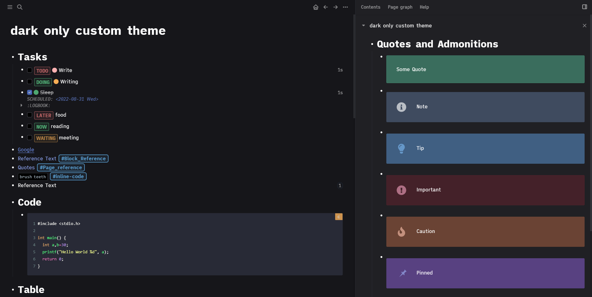
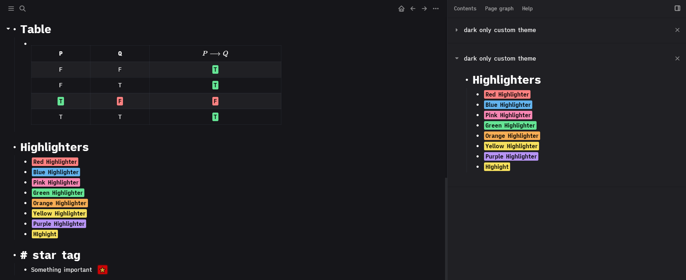

# logseq-dark-theme
A custom dark mode inspired from remnote dark theme.

## Screenshots


---


## How to install

- Copy custom.css into your custom.css file.
- Add the following in your config.edn command's section for highlighters
```
 :commands
 [
  ["Blue Highlighter" [[:editor/input "<mark class='blue'></mark>" {:backward-pos 7}]]]
["Green Highlighter" [[:editor/input "<mark class='green'></mark>" {:backward-pos 7}]]]
["Grey Highlighter" [[:editor/input "<mark class='grey'></mark>" {:backward-pos 7}]]]
["Orange Highlighter" [[:editor/input "<mark class='orange'></mark>" {:backward-pos 7}]]]
["Pink Highlighter" [[:editor/input "<mark class='pink'></mark>" {:backward-pos 7}]]]
["Red Highlighter" [[:editor/input "<mark class='red'></mark>" {:backward-pos 7}]]]
["Yellow Highlighter" [[:editor/input "<mark class='yellow'></mark>" {:backward-pos 7}]]]
["Purple Highlighter" [[:editor/input "<mark class='purple'></mark>" {:backward-pos 7}]]]
 ]
```

- Also add this line in config.edn
```
:editor/extra-codemirror-options {:theme "dracula"}
```

## Acknowledgements
- Base CSS taken from [Oxford Blue Theme](https://github.com/blueteafrog/logseq-oxfordblue-theme)
- Admonition colors from Chakra UI
- Dark colors from Remnote
- star tag code taken from [This thread](https://discuss.logseq.com/t/custom-tags-rendering-with-emojis/709)
